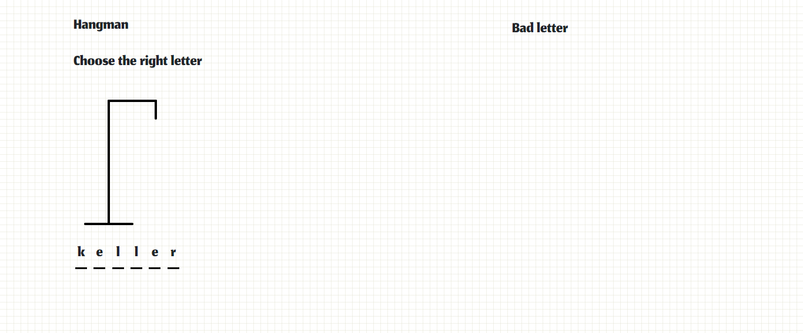
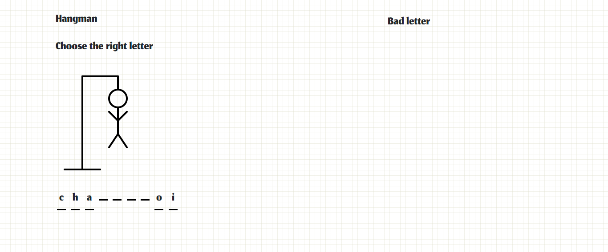

# Hangman

Réalisation d'un projet solo du bonhomme pendu  de la formation Web dév chez @becodeorg.

## Voir le projet

Vous pouvez visualiser la page web via cette url [Hangman]( https://evrardsibo.github.io/Hangman/)

## Librairie / Toolkit
* [Google Fonts](https://fonts.google.com/) - Fonts (Jomhuria et cursive)

## Auteurs
* **evrardsibo** _alias_ [@evrardsibo](https://github.com/evrardsibo)

